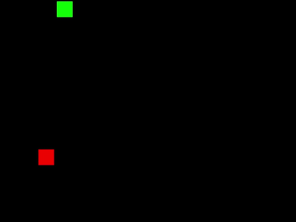

# SDL Snake Clone
Clone of the game [Snake](https://en.wikipedia.org/wiki/Snake_(video_game_genre)) clone made in C with [SDL](https://www.libsdl.org/), a cross-platform library that managed the visual output and the keyboard input.

The purpose of this project was to gain more practical experience working in the C language, not to develop an innovative game that rivals the genre. Cloning an early video game like snake was chosen for the following reasons:
1. Simple gameplay loop; the game expects very little other than to move a snake around the board, eat an apple, end the game if specific conditions are met.
2. Retro game requirements; a modern game engine would involve using a substantially more advanced rendering pipeline and have higher expectations when gather user input as opposed to the WASD movement keys in this implementation.
3. Abundant source material; it is easier to do a simple search on the internet and find out how the game Snake works and what its limitations are

||
|:--:|
|*GIF of Snake Gameplay*|
